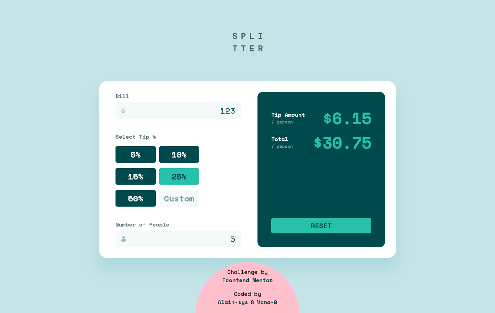
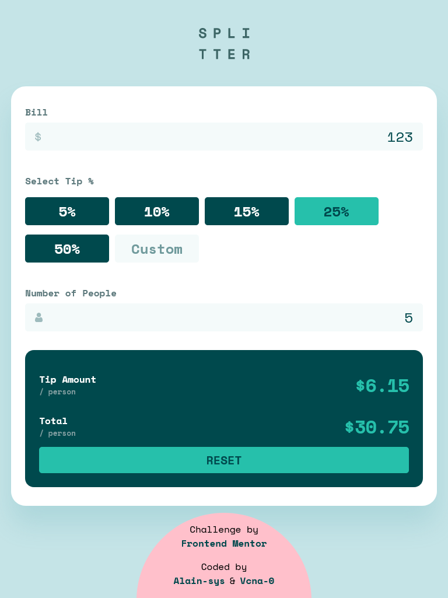
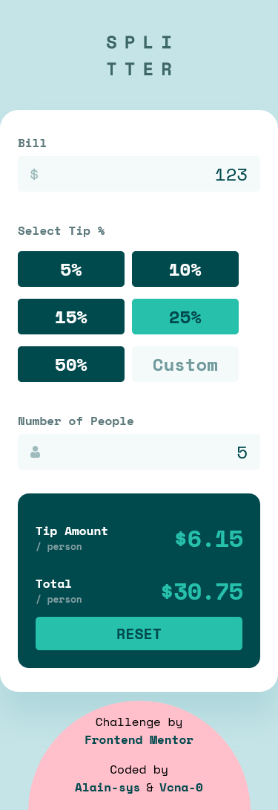

# Frontend Mentor - Tip calculator app solution

This is a solution to the [Tip calculator app solution](https://www.frontendmentor.io/challenges/officelite-coming-soon-site-M4DIPNz8g) coded by [Alain-sys](https://github.com/Alain-sys)and [Vcna-0](https://github.com/Vcna-0)!

## Table of contents

- [Overview](#overview)
  - [The challenge](#the-challenge)
  - [Screenshot](#screenshot)
  - [Links](#links)
- [My process](#my-process)
  - [Built with](#built-with)
  - [What I learned](#what-i-learned)
  - [Continued development](#continued-development)
  - [Useful resources](#useful-resources)
- [Author](#author)

## Overview

### The challenge

Users should be able to:

- View the optimal layout for the app depending on their device's screen size
- See hover states for all interactive elements on the page
- Calculate the correct tip and total cost of the bill per person

### Screenshot

  
Desktop

  

  
Tablet

  

    
  

  
Mobile

  

    
  

### Links

- [Live Site URL](https://anvc-17.github.io/Tip-calculator-app/)
- [Solution URL](https://your-solution-url.com)

## Our process

### Built with

- Semantic HTML5 markup
- CSS custom properties
- Flexbox
- Media queries
- Javascript

### What we learned

We have improve our js skills and it's more simple for us to use addEventlistener with functions.

### Continued development

We would like to progress in js.

### Useful resources

- [MDN](https://developer.mozilla.org/fr/)
- [Stackoverflow](https://stackoverflow.com/) 

## Author

- Frontend Mentor - [@Alain-sys](https://www.frontendmentor.io/profile/Alain-sys)
- Frontend Mentor - [@Vcna-0](https://www.frontendmentor.io/profile/Vcna-0)
- Github - [Alain-sys](https://github.com/Alain-sys)
- Github - [Vcna-0](https://github.com/Vcna-0)
